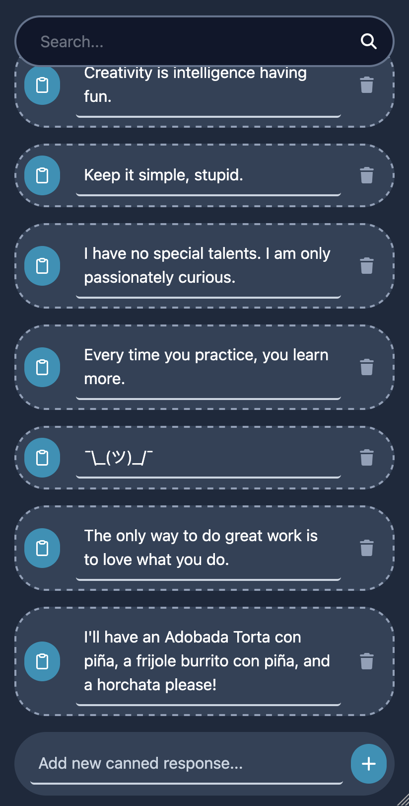

# Canned

Save the snippets of text you use all the time and copy any of them with one tap.

**Live app:** [canned.bitcrit.co](https://canned.bitcrit.co/)



## Background

I kept retyping the same bits of text: addresses, links, replies. I wanted a simple place to keep them where copying one snippet of text takes a single tap. I also wanted a hands-on way to learn progressive web apps, service workers, and IndexedDB, and this small, well-defined idea was a good fit for those experiments.

## Features

- Save, edit, and delete text snippets
- Copy any snippet to the clipboard with one tap
- Installable on your phone or desktop like a native app
- Works fully offline
- Snippets are stored locally in your browser, so nothing leaves your device

## Tech stack

- [SvelteKit](https://svelte.dev/docs/kit/introduction)
- IndexedDB with [Dexie](https://dexie.org/)
- Cloudflare [workers](https://www.cloudflare.com/products/workers) and [pages](https://www.cloudflare.com/products/pages)

## Running locally

Requires [Node.js](https://nodejs.org) and [pnpm](https://pnpm.io).

```bash
pnpm install
pnpm run dev

# or start the server and open the app in a new browser tab
pnpm run dev -- --open
```

## Building

```bash
pnpm run build
pnpm run preview   # preview the production build locally
```
